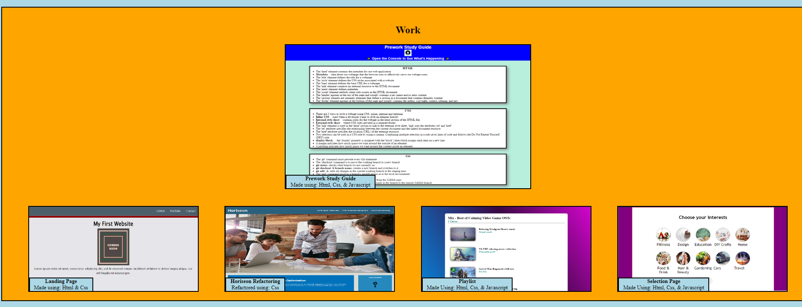
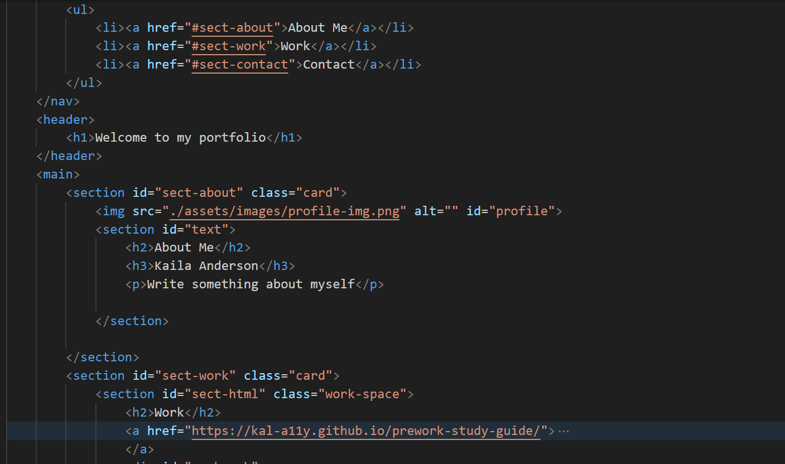

# First Professional Portfolio Page

This repo showcases my skillset using my updated set of deployed works, as well of my usage of css grid and flexbox in the index.html part of the webpage. This page also applies accessibility components for WCAC and responsive page design for mobile, medium, and large screen types.

## The Code

## License 

N/A

## Sources